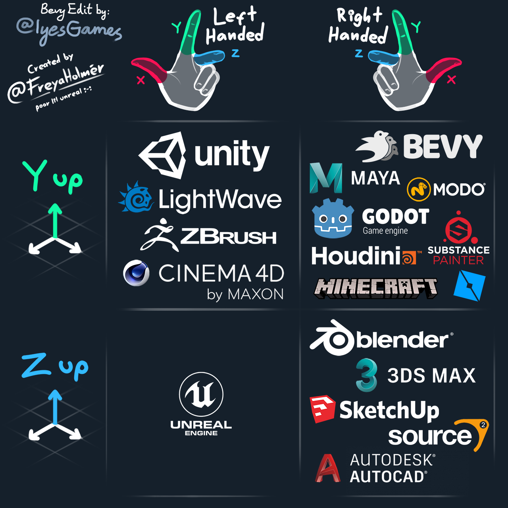

# 5.1. 坐标系

## 2D/3D场景和相机

Bevy在游戏世界中使用**右手Y轴向上**的坐标系。为了一致性，在2D和3D游戏中，我们将使用相同的坐标系。

注：左手Y轴向上 / 右手Y轴向上示意图

(该图片修改/使用受限，来源：[@FreyaHolmer](https://twitter.com/FreyaHolmer))

2D应用：

1. X轴从左到右（指向右）；

2. Y轴从下到上（指向上）；

3. Z轴从远到近（指向你，超出屏幕）；

4. 对2D来说，默认原点(X=0.0; Y=0.0)是屏幕的中心点；

当你使用2D精灵时，你可以将背景放在Z=0.0的位置，并将其他精灵放置在Z坐标逐渐增加的正值位置上，以使它们在背景上分层。

## UI

针对UI，Bevy和其他UI工具一样，遵守相同的规定。

1. 原点位于屏幕左上角；

2. Y轴指向下；

3. X的范围：0.0(屏幕左边边缘)到屏幕宽度(屏幕右边边缘)；

4. Y的范围：0.0(屏幕顶部边缘)到屏幕高度(屏幕底部边缘)；

这些单位表示逻辑（补偿 DPI 缩放）屏幕像素。

UI 布局从上到下，类似于网页。

## 光标和屏幕

光标位置和其他任何窗口坐标系都遵循和UI一样的规定。