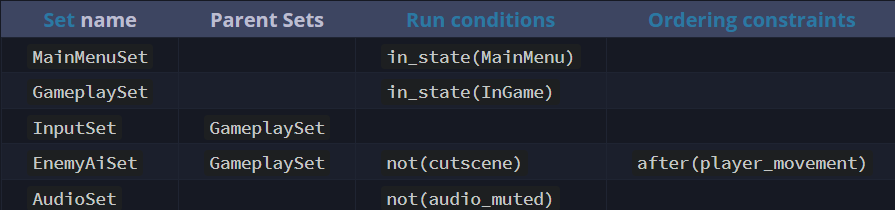

# 代码

正如在[ECS简介](./ECS编程介绍.md)中提到的那样，Bevy会帮你管理所有功能行为，并在适当的时候运行它们，并让它们访问所需的数据。

系统是功能的最小单位。每个系统都是你编写的一个Rust函数，接受特定的参数类型，以表明它需要访问的数据。函数签名就像是一个"规范"，表明需要从ECS World中获取哪些数据。

以下是一个系统的示例代码，通过函数参数我们就可以知道需要访问哪些数据：

```rust
fn enemy_detect_player(
    // 访问资源(resources)中的数据
    mut ai_settings: ResMut<EnemyAiSettings>,
    gamemode: Res<GameModeData>,
    // 访问实体/组件中的数据
    query_player: Query<&Transform, With<Player>>,
    query_enemies: Query<&mut Transform, (With<Enemy>, Without<Player>)>,
    // 用来生成/销毁实体，等等
    mut commands: Commands,
) {
    // ... implement your behavior here ...
}
```

## 平行系统

基于系统(system)的参数类型，Bevy 能够知道每个系统能访问的数据，以及它是否会和其他系统冲突。不会冲突的系统(不会同时修改数据)会自动在不同的CPU线程平行运行。这样，你将自动获得多线程处理的能力，有效地利用现代多核 CPU 硬件，而无需付出额外的努力！

为了达到最佳的并行性能，建议你的功能和数据保持较小的粒度。创建很多小的系统，每个系统实现单一的目标，访问仅需的数据。这样可以让 bevy 更容易并行执行。在一个系统中执行太多的功能，或者把太多的数据放在组件/实体中，会限制并行能力。

Bevy 的并行性默认情况下是非确定性的。你的系统可能会以不同且不可预测的顺序运行，除非你添加排序依赖来约束它。

## 独占系统

独占系统为你提供一种[完全直接访问ECS世界](./direct_ecs_world_access.md)的方式，它不能和其他系统平行运行，因为它们可以访问任何东西，做任何事情。

```rust
fn save_game(
    // 能够完全访问ECS世界，所以我们可以访问所有数据，做任何事情
    world: &mut World,
) {
    // ... save game data to disk, or something ...
}
```

## schedules

`schedules`中存储系统和相关的元数据(metadata)，元数据用来告诉 Bevy 如何以及何时调用系统。Bevy 中包含很多`schedules`，每一个都会在特定的情况下被调用。

2种元数据：

1. [run conditions](./run_condition.md)：根据条件是否执行某些系统；

2. [ordering](./system_order_of_excution.md)：一个系统等待另一个系统执行完；

在`schedule`中,系统可以被组织进[set](./system_sets.md)中。set可以让多个系统共享相同的元数据/配置。系统继承他所属的 set 的配置。set 也可以从其他 set 中继承配置。

以下是一个说明，帮助您想象一个 schedule 的逻辑结构。让我们看一下一个假设的游戏的“更新”（每帧运行）schedule 是如何组织的。

系统列表：


set 列表：



需要注意的是，在 schedule 中列出的系统顺序并不重要。执行顺序由元数据决定。Bevy 会尊重这些约束，但在其他方面，它会尽可能地并行运行系统，这取决于可用的 CPU 线程。

同样需要注意的是，在我们假设的游戏中，使用了许多单独的小系统来实现。例如，我们没有在 `player_movement` 系统中播放音频，而是创建了一个单独的 `play_footstep_sounds` 系统。这两个功能可能需要访问不同的数据，因此将它们放在单独的系统中可以让 Bevy 有更多的机会进行并行处理。作为独立的系统，它们也可以有不同的配置。`play_footstep_sounds` 系统可以被添加到 `AudioSet` 集合中，从而继承 `not(audio_muted)` 运行条件。

类似地，我们将鼠标和控制器输入放在单独的系统中。`InputSet` 集合允许像 `player_movement` 这样的系统共享同一个排序依赖。

你可以看到 Bevy 的 schedule API 为你组织游戏中的所有功能提供了很大的灵活性。你会如何利用这一切力量呢？;)

----

以下是如何使用代码创建上面说明的 Schedule：

```rust
// Set configuration is per-schedule. Here we do it for `Update`
app.configure_sets(Update, (
    MainMenuSet
        .run_if(in_state(MainMenu)),
    GameplaySet
        .run_if(in_state(InGame)),
    InputSet
        .in_set(GameplaySet),
    EnemyAiSet
        .in_set(GameplaySet)
        .run_if(not(cutscene))
        .after(player_movement),
    AudioSet
        .run_if(not(audio_muted)),
));
app.add_systems(Update, (
    (
        ui_button_animate,
        menu_logo_animate.in_set(MainMenuSet),
    ),
    (
        enemy_movement,
        enemy_spawn,
        enemy_despawn.before(enemy_spawn),
    ).in_set(EnemyAiSet),
    (
        mouse_input.run_if(mouse_enabled),
        controller_input.run_if(gamepad_enabled),
    ).in_set(InputSet),
    (
        footstep_sound.in_set(GameplaySet),
        menu_button_sound.in_set(MainMenuSet),
        background_music,
    ).in_set(AudioSet),
    (
        player_movement
            .run_if(player_alive)
            .run_if(not(cutscene)),
        camera_movement,
    ).in_set(GameplaySet).after(InputSet),
));
```