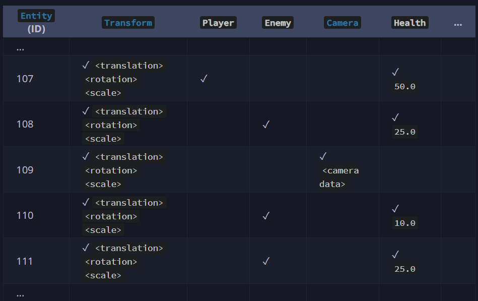

# 介绍-你的数据

正如在[ECS简介](./ECS编程介绍.md)中提到的那样，Bevy会帮你存储所有的数据，并允许你在任何需要的地方轻松灵活地访问它们。

ECS的数据结构称为 [`World`](./direct_ecs_world_access.md)。它存储和管理所有的数据。在高级场景中，可能会有多个 `World`，每个 `World` 都会作为一个独立的 ECS 实例运行。然而，通常情况下，你只需要与Bevy为你的App设置的主 `World` 一起工作。

你可以用2种方式来表示你的数据：[实体/组件](./entities_and_components.md)（Entities/Components）和[资源](./resources.md)（Resources）。

## Entities/Components

概念上，你可以通过类比表格来理解它，就像在数据库或电子表格中一样。不同的数据类型（组件）就像表的“列”，可以有任意多个包含各种值/组件实例的“行”（实体）。实体 ID 就像行号，是一个整数索引，可以让你找到特定的组件值。

不包含数据的组件被称为[标记组件](./entities_and_components.md#marker-components)。它们很有用，可以作为“标签”来识别特定的实体，或启用某些行为。例如，你可以用它们来识别玩家实体，标记当前正在追逐玩家的敌人，选择在关卡结束时要消失的实体等等。

下面这个图可以帮你形象地理解这种逻辑结构。复选标记(✓)表示组件存在。空单元格表示组件不存在。在这个例子中，我们有一个玩家，一个相机，和几个敌人。



这种表示方式为你提供了很大的灵活性。例如，你可以为你的游戏创建一个 `Health` 组件。然后，你可以在游戏中创建许多代表不同事物的实体，例如玩家、NPC或怪物，它们都可以有一个 `Health` 值（以及其他相关组件）。

一个典型和明显的模式是使用实体来表示“游戏/场景中的对象”，例如相机、玩家、敌人、灯光、道具、UI 元素和其他事物。然而，你不仅限于此。ECS 是一个通用的数据结构。你可以创建实体和组件来存储任何数据。例如，你可以创建一个实体来存储一堆设置或配置参数，或其他抽象的东西。

使用实体和组件存储的数据通过[查询](./queries.md)(Query)进行访问。例如，如果你想实现一个新的游戏机制，编写一个系统（只是一个带有特殊参数的Rust函数），指定你想要访问的组件类型，然后做你想做的事情。你可以遍历所有符合你查询的实体，或者访问特定实体（使用实体ID）。

```rust
#[derive(Component)]
struct Xp(u32);

#[derive(Component)]
struct Health {
    current: u32,
    max: u32,
}

fn level_up(
    // We want to access the Xp and Health data:
    mut query: Query<(&mut Xp, &mut Health)>,
) {
    // process all relevant entities
    for (mut xp, mut health) in query.iter_mut() {
        if xp.0 > 1000 {
            xp.0 -= 1000;
            health.max += 25;
            health.current = health.max;
        }
    }
}
```

Bevy 可以自动跟踪你的系统可以访问哪些数据，并在多个 CPU 核心上并行运行它们。这样，你无需额外努力就能获得多线程处理！

如果你想创建或删除实体和组件，而不仅仅是访问现有的数据呢？那需要特别考虑。Bevy 不能在其他系统可能正在运行时改变内存布局。可以使用[命令](./commands.md)（Commands）缓冲或延迟这些操作。Bevy 会在确保安全的情况下稍后执行它们。如果你想立即执行这些操作，你可以使用[独占系统](./exclusive_system.md)来[直接访问世界](./direct_ecs_world_access.md)。

[捆绑包](./bundles.md)（bundle）就像是一组常用组件的“模板”，当你想创建一些实体时，它可以帮助你，这样你就不会忘记其他任何东西。

```rust
/// Marker for the player
#[derive(Component)]
struct Player;

/// Bundle to make it easy to spawn the player entity
/// with all the correct components:
#[derive(Bundle)]
struct PlayerBundle {
    marker: Player,
    health: Health,
    xp: Xp,
    // including all the components from another bundle
    sprite: SpriteBundle,
}

fn spawn_player(
    // needed for safely creating/removing data in the ECS World
    // (anything done via Commands will be applied later)
    mut commands: Commands,
    // needed for loading assets
    asset_server: Res<AssetServer>,
) {
    // create a new entity with whatever components we want
    commands.spawn(PlayerBundle {
        marker: Player,
        health: Health {
            current: 100,
            max: 125,
        },
        xp: Xp(0),
        sprite: SpriteBundle {
            texture: asset_server.load("player.png"),
            transform: Transform::from_xyz(25.0, 50.0, 0.0),
            // use the default values for all other components in the bundle
            ..Default::default()
        },
    });

    // Call .id() if you want to store the Entity ID of your new entity
    let my_entity = commands.spawn((/* ... */)).id();
}
```

## 和面向对象思想的比较

面向对象编程教导你将一切视为“对象”，每个对象都是“类”的一个实例。类在一个地方指定了该类型所有对象的数据和功能。该类的每个对象都有相同的数据（值不同）和相同的相关功能。

这与 ECS（实体组件系统）的心态相反。在 ECS 中，任何实体都可以拥有任何数据（任何组件的组合）。实体的目的是识别这些数据。你的系统是可以操作任何数据的松散功能块。它们可以很容易地找到他们正在寻找的东西，并实现期望的行为。

如果你是一个面向对象的程序员，你可能会想要定义一个巨大的单体结构 `Player` ，包含玩家的所有字段/属性。在 Bevy 中，这被认为是不好的做法，因为这样做可能会使你的数据更难处理，并限制性能。相反，你应该在不同的数据片段可能需要独立访问时，使它们更加细化。

例如，在你的游戏中将玩家表示为一个实体，由独立的组件类型（独立的结构）组成，用于健康、经验值或任何与你的游戏相关的东西。你也可以附加标准的 Bevy 组件，如 `Transform`（转换解释）。

然后，每个功能（每个系统）可以查询它需要的数据。常见功能（如健康/伤害系统）可以应用于任何能匹配组件的实体，无论这是玩家还是游戏中的其他东西。

如果你有只应该应用于玩家实体的功能，你可以使用一个[标记组件](./entities_and_components.md#marker-components)（如`struct Player;`）来缩小你的查询（使用一个查询过滤器，如 `With<Player>`）。

然而，如果某些数据总是被一起访问，那么你应该把它们放在一个单一的结构中。例如，Bevy 的 `Transform`。对于这些类型，字段不太可能单独使用。

## 其他内部细节

给定实体所拥有的组件集/组合被称为该实体的原型。Bevy 在内部跟踪这一点，以组织 RAM 中的数据。具有相同原型的实体的数据将被存储在一起，形成连续的数组，这允许 CPU 高效地访问和缓存数据。

如果你在现有的实体上添加或移除组件类型，你就是在改变原型，这可能需要 Bevy 将之前存在的数据移动到不同的位置。

[了解更多关于Bevy的组件存储。](./component_storage.md)

Bevy 会重用实体ID。`Entity` 类型实际上是两个整数：ID和"generation"。在你销毁一些实体后，它们的ID可以被重新用于新生成的实体，但Bevy会增加它们的 generation 值。

## Resources

如果某个东西是全局唯一的(单例),而且它不与其他数据关联,使用`Resource`。

如果某个东西是全局唯一的（单例），而且它是独立的（不与其他数据关联），那就使用资源(Resource)。

例如，你可以创建一个资源来存储你的游戏的图形设置，或者一个非Bevy库的接口。

当你知道你不需要实体/组件的灵活性时，这是一种简单的数据存储方式。

```rust
#[derive(Resource)]
struct GameSettings {
    current_level: u32,
    difficulty: u32,
    max_time_seconds: u32,
}

fn setup_game(
    mut commands: Commands,
) {
    // Add the GameSettings resource to the ECS
    // (if one already exists, it will be overwritten)
    commands.insert_resource(GameSettings {
        current_level: 1,
        difficulty: 100,
        max_time_seconds: 60,
    });
}

fn spawn_extra_enemies(
    mut commands: Commands,
    // we can easily access our resource from any system
    game_settings: Res<GameSettings>,
) {
    if game_settings.difficulty > 50 {
        commands.spawn((
            // ...
        ));
    }
}

```